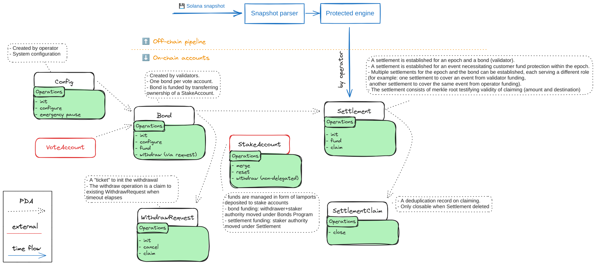

# validator-bonds

Mono repository for Validator Bonds product

## Repository structure

* [`programs/validator-bonds`](./programs/validator-bonds/) - Anchor on-chain contract project 
* [`packages/`](./packages/) - TypeScript packages related to on-chain program
  ([SDK](./packages/validator-bonds-sdk/), [CLI](./packages/validator-bonds-cli/))
* [`api/`](./api/) - in Rust developed OpenAPI service that publishes bonds data ([API endpoint](https://validator-bonds-api.marinade.finance/docs))
* [`.buildkite/`](./.buildkite/) - automated pipelines that prepare data for bonds claiming, updating API data and similar
* [`insurance-engine/`](./insurance-engine/) - code for a CLI creating protected event data that is published in form of JSON and packed as a settlement on-chain
* [`merkle-tree/`](./merkle-tree/) - generic Rust library implementing the merkle tree data structure management
* [`migrations/`](./migrations/) - SQL scripts to prepare and change DB schemas
* [`scripts/`](./scripts/) - scripts used in pipeline and to manage and integrate various repository parts
* [`snapshot-parser`](./snapshot-parser/) - a CLI for parsing Solana snapshots and providing data to be processed by `insurance-engine`
* [`validator-bonds-cli`](./validator-bonds-cli/) - CLI used by operator to manage bonds (user related CLI is [packages/CLI](./packages/validator-bonds-cli/))

## User related CLI from source

To run the CLI you need to have installed Node.js in version 16+ and `pnpm`.
For details on CLI options see [validator-bonds-cli README](./packages/validator-bonds-cli/README.md).

```sh
# installing TS dependencies
pnpm install
# run CLI
pnpm cli --help
```

## Workflow and on-chain data



// TODO: can we utilize the diagram from Notion referring to process that happens off-chain?

### Detailed description

1. The `Config` account is managed by the administrator.
   - The administrator configures the timeout for `WithdrawRequest`, and defines the time for availability to claim `Settlement`.
   - The administrator configures the `operator authority` and the `emergency pause authority`.
   - The operator authority manages the creation of settlements, funding settlements, and withdrawing non-delegated `StakeAccounts`.
   - The emergency pause authority may pause the contract with the `emergency pause` action.

2. The `Bond` account is created by validators and is strictly linked to a `VoteAccount`.
   - The `Bond` account may be created in either _permissioned_ mode or _permission-less_ mode.
     1. For _permissioned_ mode, the validator signs with their `validator identity` and configures the `bond authority`. The `bond authority` then has permission to make configuration changes and request fund withdrawals.
     2. For _permission-less_ mode, the bond account is created first, and additional operations are necessary to set up the `bond authority`.
   - Funding the `Bond` means depositing a [`StakeAccount`](https://github.com/solana-labs/solana/blob/v1.18.2/runtime/src/stake_account.rs#L19) under the Validator Bonds program.
     - To fund a [`StakeAccount`](https://github.com/solana-labs/solana/blob/v1.18.2/runtime/src/stake_account.rs#L19), it must be delegated (field [`node_pubkey`](https://github.com/solana-labs/solana/blob/v1.18.2/sdk/program/src/vote/state/mod.rs#L287)) to the same [`VoteAccount`](https://github.com/solana-labs/solana/blob/367f489f632d6be0fd93e95cc2c5b7202515fe6e/vote/src/vote_account.rs#L32) as the `Bond` was created with.
     - Upon funding the `StakeAccount`, withdrawer and staker authorities are [assigned under the program's PDA address](#stake-account-authorities-transitions).
     - The `Bond` is linked to one `VoteAccount`. The `StakeAccount` is delegated to a `VoteAccount`. The Validator Bond program never changes the delegation of the funded `StakeAccount`. The linking of the `StakeAccount` to `Bond` is done using the delegated `VoteAccount` pubkey from the `StakeAccount`.
     - The number of lamports credited to the `StakeAccount` is considered the funded amount for the `Bond`. The funded amount will likely increase over time (when no protected events occur) as the `StakeAccount` is delegated and earns Solana inflation rewards.

3. Withdrawing funded `Bond` is permitted to the validator, the owner of the `bond authority`.
   The withdrawal is delayed by a factor configured in `Config` as [`withdraw_lockup_epochs`](./programs/validator-bonds/src/state/config.rs#L17). The withdrawal process comes as a two-step process.
   1. Validator [initiates](./programs/validator-bonds/src/instructions/withdraw/init_withdraw_request.rs) a [`WithdrawRequest`](./programs/validator-bonds/src/state/withdraw_request.rs).
      - The withdraw request is created with the number of lamports that the validator plans to withdraw from the `Bond`.
      - ([The requested amount](./programs/validator-bonds/src/state/withdraw_request.rs#L17)) is no longer considered as funded.
   2. When the timeout of withdraw lockup epochs elapses, the validator may execute
      [`claim withdraw request operation`](./programs/validator-bonds/src/instructions/withdraw/claim_withdraw_request.rs)
      that brings withdrawer and staker authority back to the validator.
   - The `WithdrawRequest` can be [cancelled](./programs/validator-bonds/src/instructions/withdraw/cancel_withdraw_request.rs) (account deleted) at any time.

4. Operator authority creates a `Settlement` (represented by an on-chain account) when a protected event happens.
   The protected event is established for under-performing validators, usually once per epoch when network inflation rewards are distributed.
   The operator calculates losses against standard validator performance in the epoch; these losses are recorded in the form of a merkle tree
   per `VoteAccount`, and a `Settlement` with a merkle root is created on-chain. The merkle tree contains the list of creditors and their entitlements to the protected event.
   - Operator authority funds the `Settlement` with amount of lamports equal to the sum of losses recorded in the merkle tree.
      - The funding instruction assigns the bonds funded `StakeAccounts` under `Settlement` by assigning their staker authority
        under derived `Settlement's` staker PDA.
      - `StakeAccounts` funded to a `Settlement` cannot be used for withdrawing funded `Bond`
      - Funding `StakeAccount` to `Settlement` deactivates the `StakeAccount` to make it possible to withdraw the lamports
      - *Expectation:* To fully used the whole amount of lamports funded under the bond program by the validator
        the operator is required to merge all the `StakeAccounts` of the validator (delegated to the same `VoteAccount`)
        first and then fund such `StakeAccount` into `Settlement`. And the instruction is then capable to split `StakeAccount`
        with spill amount when needed.
   - The creditor may claim the calculated amount from the `Settlement`. A deduplication
      account, `SettlementClaim`, is created on-chain, referring to the fact that the protected event has already been claimed by the creditor.
   - The `Settlement` may be claimed only for a limited number of epochs, which is configured by the admin authority in `Config`.
     After the elapsed time, the `Settlement` can be closed, and nothing more can be claimed.
     - When the claim time availability elapses, the `Settlement` account can be closed, and the account rent is withdrawn.
   - The claiming instruction requires a `StakeAccount` that was funded under `Settlement`
     (withdrawer authority is Bonds withdrawer PDA, staker authority is Settlement staker PDA)
     and that has been waited for being deactivated. Then the lamports can be withdrawn into a destination
     `StakeAccount` which is determined by merkle tree creditor record.
     Intentionally the claim instruction does not check what [state](https://github.com/solana-labs/solana/blob/v1.18.2/sdk/program/src/stake/state.rs#L138) is the `StakeAccount` in.

5. There are few operations dedicated to `StakeAccount` management.
   - After closing the `Settlement` the un-claimed `StakeAccounts` may be
     - reset (in case of delegated ones); permission-less operation
     - withdrawn (in case of non-delegated in `Initialized` state ones); permissioned by operator authority
   - Any two `StakeAccounts` may be merged into single one when they consists of the same withdrawer authority,
     staker authority and they are both delegated to the same `VoteAccount`. Permission-less operation.


### Stake Account authorities transitions

**Invariant:**

- one `Bond` account per `VoteAccount`
- the Validator Bonds **never** changes the `StakeAccount` [delegation](https://github.com/solana-labs/solana/blob/master/sdk/program/src/stake/state.rs#L599) to any `VoteAccount`

**Derived addresses:**

- _Bonds withdrawer PDA_ is an address derived from `Config`
- _Settlement staker PDA_ is an address derived from `Settlement`

| Stake Account State                    | Withdrawer authority  | Staker authority      |
| -------------------------------------- | --------------------- | --------------------- |
| Owned by validator (not funded)        | _validator authority_ | _validator authority_ |
| Funded to bonds program                | Bonds withdrawer PDA  | Bonds withdrawer PDA  |
| Funded to settlement (protected event) | Bonds withdrawer PDA  | Settlement staker PDA |
| Reset (on settlement close)            | Bonds withdrawer PDA  | Bonds withdrawer PDA  |
| Settlement withdraw request claimed    | _validator authority_ | _validator authority_ |


## Development

### Validator Bonds CLI

```sh
cargo build --release

# Collect bonds data in YAML format
./target/release/validator-bonds-cli \
  collect-bonds -u "$RPC_URL" > bonds.yaml

# Store YAML bonds data to a POSTGRES DB
./target/release/validator-bonds-api-cli \
  store-bonds --postgres-url "$POSTGRES_URL" --input-file bonds.yaml
```

### Validator Bonds API

```sh
cargo build --release

# Run API on port 8000 (default) or set a custom one using --port
./target/release/api \
  --postgres-url "$POSTGRES_URL"
```

### On-Chain related parts

To build the Anchor program use the [`scripts`](./package.json) of the `pnpm`.

```sh
# install TS dependencies
pnpm install

# building Anchor program + cli and sdk TS packages
pnpm build

# testing the SDK+CLI against the bankrun and local validator
pnpm test
# bankrun part of the tests
pnpm test:bankrun
# local validator part of the tests
pnpm test:validator
# cargo tests in rust code
pnpm test:cargo
```

#### Contract deployment

```sh
anchor build --verifiable \
  --env "GIT_REV=`git rev-parse --short HEAD`" --env 'GIT_REV_NAME=<SOME_VERSION>'

# 1. DEPLOY
## deploy (devnet, hot wallet upgrade)
solana program deploy -v -ud \
   --program-id vBoNdEvzMrSai7is21XgVYik65mqtaKXuSdMBJ1xkW4 \
   -k [fee-payer-keypair]
   --upgrade-authority [path-to-keypair] \
   ./target/verifiable/validator_bonds.so

# deploy (mainnet, SPL Gov authority multisig, governance 7iUtT...wtBZY)
solana -um -k [fee-payer-keypair] \
    program write-buffer target/verifiable/validator_bonds.so
solana -um -k [fee-payer-keypair] \
    program set-buffer-authority \
    --new-buffer-authority 6YAju4nd4t7kyuHV6NvVpMepMk11DgWyYjKVJUak2EEm <BUFFER_PUBKEY>


# 2. IDL UPDATE, idl account Du3XrzTNqhLt9gpui9LUogrLqCDrVC2HrtiNXHSJM58y)
## publish IDL (devnet, hot wallet)
anchor --provider.cluster devnet idl \
  --provider.wallet [fee-payer-keypair] \
  # init vBoNdEvzMrSai7is21XgVYik65mqtaKXuSdMBJ1xkW4 \
  upgrade vBoNdEvzMrSai7is21XgVYik65mqtaKXuSdMBJ1xkW4 \
  -f ./target/idl/validator_bonds.json

## publish IDL (mainnet, spl gov)
anchor idl write-buffer --provider.cluster mainnet --provider.wallet [fee-payer-keypair] \
  --filepath target/idl/validator_bonds.json vBoNdEvzMrSai7is21XgVYik65mqtaKXuSdMBJ1xkW4
anchor idl set-authority --provider.cluster mainnet --provider.wallet [fee-payer-keypair] \
  --new-authority 6YAju4nd4t7kyuHV6NvVpMepMk11DgWyYjKVJUak2EEm --program-id vBoNdEvzMrSai7is21XgVYik65mqtaKXuSdMBJ1xkW4 \
  <BUFFER_PUBKEY>

## in case a need of base64 anchor update
anchor idl --provider.cluster mainnet --print-only \
  set-buffer --buffer <BUFFER_PUBKEY> vBoNdEvzMrSai7is21XgVYik65mqtaKXuSdMBJ1xkW4


# 3.check verifiable deployment (<BUFFER_PUBKEY> can be verified as well)
#   a) when the target/verifiable/.so has been built already use switch --skip-build
anchor --provider.cluster mainnet \
   verify -p validator_bonds \
   --env "GIT_REV=`git rev-parse --short HEAD`" --env 'GIT_REV_NAME=v1.1.0' \
   <PROGRAM_ID_or_BUFFER_ID>

```
